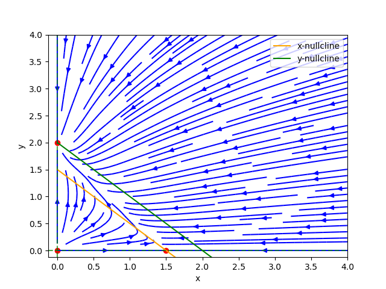

<h1>Competitive Species</h1>

Duas espécies competindo por um mesmo suprimento de alimento. Uma é mais forte que a outra.

```math
\begin{align}
    &x' = x\,(3 - 2\,x - 2\,y), \\
    &y' = y\,(2 - x - y).
\end{align}
```

<h2>Análise Qualitativa</h2>

<h3>Determinando as x-nullclines</h3>
<p>
As x-nullclines são os pontos do plano em que $x\\,(3 - 2\\,x - 2\\,y) = 0$, isto é, as x-nullclines são: $x = 0$ e $2\\,y = 3 - 2\\,x$.
</p>

<h3>Determinando as y-nullclines</h3>
<p>
As y-nullclines são os pontos do plano em que $y\\,(2 - x - y) = 0$. Assim, as y-nullclines são dadas por: $y = 0$ e $y = 2 - x$.
</p>

<h3>Pontos de equilíbrio</h3>
<p>
Os pontos de equilíbrio são determinados pelas interseções das x-nullclines com as y-nullclines. Observamos que as retas $2\\,y = 3 - 2\\,x$ e $y = 2 - x$ são paralelas e portanto não se intersectam. Assim, temos os seguintes pontos de equilíbrio: $(0, 0), (0, 2), \left(\frac{3}{2}, 0\right)$.
</p>

<h3>Retrato de fase</h3>
<p>
De posse das nullclines e dos pontos de equilíbrio, somos capazes de esboçar o retrato de fase do sistema. Abaixo apresentamos esse esboço com juntamente com os pontos de equilíbrio e as nullclines:
</p>
<div align="center">
    
</div>

<h3>Linearização</h3>
A matriz jacobiana para o sistema é a matriz $A$ dada por:

```math
    A = \begin{pmatrix}
        3 - 4\,x - 2\,y & - 2\,x \\ - y & 2 - x - 2\,y
    \end{pmatrix}
```
Desta forma, o sistema linearizado na origem $(0,0)$ é dado por:
```math
\begin{pmatrix} u' \\ v' \end{pmatrix} = 
\begin{pmatrix} 3 & 0 \\ 0 & 2 \end{pmatrix}\,\begin{pmatrix} u \\ v \end{pmatrix} = B\,\begin{pmatrix} u \\ v \end{pmatrix}
```
Podemos observado que a matriz $B$ possui os autovalores $\lambda_1 = 3$ e $\lambda_2 = 2$. Como ambos os autovalores são positivos, o sistema não é hiperbólico e a solução do sistema linearizado próximo da origem descreve qualitativamente o sistema original. Portanto, o ponto de equilíbrio $(0, 0)$ é do tipo fonte. Assim, as soluções se afastam deste ponto ao longo do tempo.
